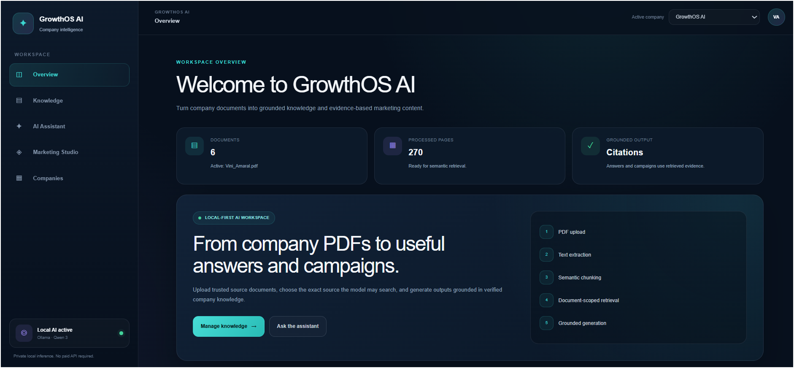
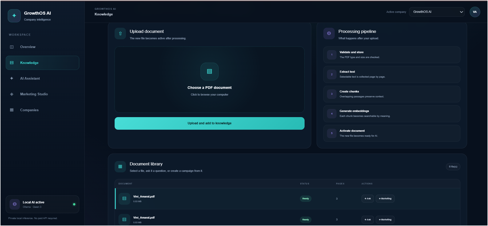
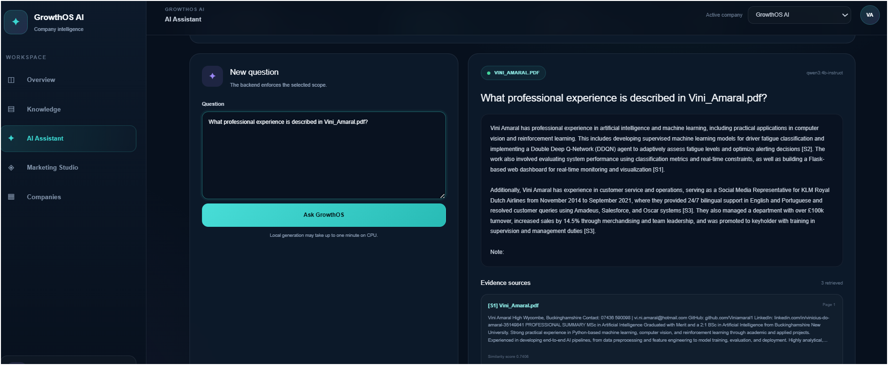
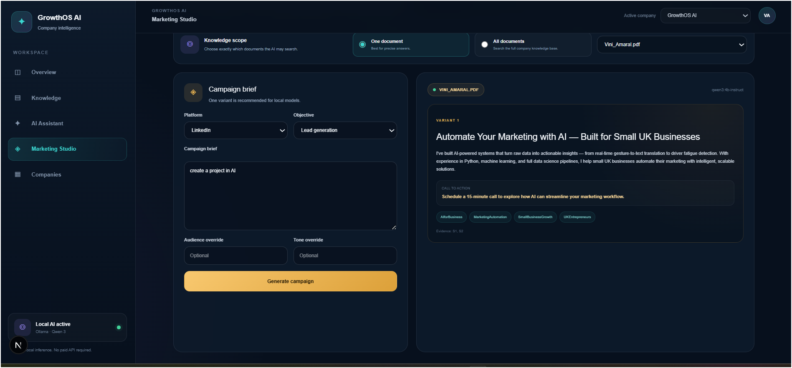

<div align="center">

# GrowthOS AI

### Local-first company intelligence and marketing platform

Upload company documents, build a semantic knowledge base, ask grounded questions with citations, and generate evidence-based marketing content using a local Ollama model.

**FastAPI · Next.js · TypeScript · FastEmbed · Ollama · SQLAlchemy · SQLite**

</div>

---

## Overview

GrowthOS AI is a full-stack Retrieval-Augmented Generation application designed to turn company documents into useful business knowledge and marketing content.

Users can create a company workspace, upload PDF documents, process them into searchable chunks, ask questions grounded in the uploaded evidence, and generate platform-specific marketing campaigns.

The application runs locally with Ollama, avoiding mandatory paid API usage and keeping company documents on the user’s machine.

---

## What GrowthOS AI Can Do

### Company knowledge workspaces

Create and manage company profiles containing:

- company name
- website
- industry
- target audience
- brand tone
- product or service description

Each company has an independent document knowledge base.

### PDF document intelligence

The ingestion pipeline:

1. validates PDF uploads
2. stores files safely using unique generated filenames
3. extracts selectable text with PyMuPDF
4. preserves page references
5. creates overlapping text chunks
6. generates semantic embeddings
7. stores chunk metadata for retrieval

### Semantic search

GrowthOS AI searches by meaning rather than exact keyword matches.

A question such as:

> What services does the company provide?

can retrieve relevant passages even when the document uses different wording.

### Grounded question answering

The assistant:

1. embeds the user’s question
2. retrieves the most relevant company-document chunks
3. sends only that evidence to Ollama
4. generates a concise answer
5. returns document and page citations
6. refuses unsupported claims when evidence is insufficient

### Marketing Studio

Generate grounded content for:

- LinkedIn
- Instagram
- Facebook
- Google Ads
- email campaigns

Each generated variant can include:

- headline
- body copy
- call to action
- hashtags
- evidence citations

---

## Screenshots


### Dashboard



### Knowledge Base



### AI Assistant



### Marketing Studio



---

## Architecture

```text
┌───────────────────────────────┐
│       Next.js Frontend        │
│ React · TypeScript · Tailwind │
└───────────────┬───────────────┘
                │ HTTP
                ▼
┌───────────────────────────────┐
│        FastAPI Backend        │
│ Pydantic · SQLAlchemy · REST  │
└───────────────┬───────────────┘
                │
        ┌───────┴────────┐
        ▼                ▼
┌───────────────┐  ┌───────────────┐
│ Company Data  │  │ PDF Documents │
└───────────────┘  └───────┬───────┘
                           ▼
                   ┌───────────────┐
                   │ Text Extraction│
                   │    PyMuPDF     │
                   └───────┬───────┘
                           ▼
                   ┌───────────────┐
                   │ Page-aware     │
                   │ Chunking       │
                   └───────┬───────┘
                           ▼
                   ┌───────────────┐
                   │ FastEmbed      │
                   │ Embeddings     │
                   └───────┬───────┘
                           ▼
                   ┌───────────────┐
                   │ SQLite Storage │
                   │ + Chunk Data   │
                   └───────┬───────┘
                           ▼
                   ┌───────────────┐
                   │ Semantic       │
                   │ Retrieval      │
                   └───────┬───────┘
                           ▼
                   ┌───────────────┐
                   │ Ollama + Qwen  │
                   │ Local LLM      │
                   └───────┬───────┘
                           │
             ┌─────────────┴─────────────┐
             ▼                           ▼
   ┌───────────────────┐       ┌───────────────────┐
   │ Grounded Answers  │       │ Marketing Studio  │
   │ with Citations    │       │ with Evidence     │
   └───────────────────┘       └───────────────────┘
```

---

## Technology Stack

| Area | Technologies |
|---|---|
| Frontend | Next.js, React, TypeScript, Tailwind CSS |
| Backend | Python, FastAPI, Pydantic, Uvicorn |
| Database | SQLAlchemy, SQLite |
| Document processing | PyMuPDF |
| Embeddings | FastEmbed, NumPy |
| Local generation | Ollama, Qwen |
| Development | Git, GitHub, VS Code, Swagger UI |

---

## Project Structure

```text
GrowthOS-AI/
├── backend/
│   ├── app/
│   │   ├── api/
│   │   │   └── routes/
│   │   ├── database/
│   │   ├── models/
│   │   ├── schemas/
│   │   ├── services/
│   │   └── main.py
│   ├── uploads/
│   ├── .env.example
│   └── requirements.txt
│
├── frontend/
│   ├── app/
│   ├── lib/
│   ├── public/
│   ├── .env.local
│   └── package.json
│
├── docs/
│   └── images/
│
├── .gitignore
├── LICENSE
└── README.md
```

---

## Getting Started

### Prerequisites

Install:

- Python 3.12 or later
- Node.js LTS
- Git
- Ollama

Verify:

```bash
python --version
node --version
npm --version
git --version
ollama --version
```

---

## Backend Setup

From the project root:

```powershell
cd backend
python -m venv .venv
.venv\Scripts\Activate.ps1
python -m pip install --upgrade pip
python -m pip install -r requirements.txt
```

Create the local backend environment file:

```powershell
Copy-Item .env.example .env
```

Example configuration:

```env
OLLAMA_BASE_URL=http://localhost:11434
OLLAMA_MODEL=qwen3:4b-instruct
```

Start FastAPI:

```powershell
python -m uvicorn app.main:app --reload
```

Backend:

```text
http://127.0.0.1:8000
```

Swagger documentation:

```text
http://127.0.0.1:8000/docs
```

---

## Ollama Setup

Download the local model:

```powershell
ollama pull qwen3:4b-instruct
```

Test it:

```powershell
ollama run qwen3:4b-instruct
```

Exit with:

```text
/bye
```

Ollama’s local service is normally available at:

```text
http://localhost:11434
```

---

## Frontend Setup

Open a second terminal:

```powershell
cd frontend
npm install
```

Create:

```text
frontend/.env.local
```

Add:

```env
NEXT_PUBLIC_API_URL=http://127.0.0.1:8000/api/v1
```

Start Next.js:

```powershell
npm run dev
```

Open:

```text
http://localhost:3000
```

---

## Running the Full Application

GrowthOS AI uses three local services:

| Service | Address |
|---|---|
| Frontend | `http://localhost:3000` |
| Backend | `http://127.0.0.1:8000` |
| Ollama | `http://localhost:11434` |

Recommended startup order:

1. confirm Ollama is running
2. start FastAPI
3. start Next.js
4. open the dashboard
5. select or create a company
6. upload and process a PDF
7. ask a grounded question
8. generate a marketing campaign

---

## API Overview

### Health

```text
GET /api/v1/health
```

### Companies

```text
POST /api/v1/companies
GET  /api/v1/companies
GET  /api/v1/companies/{company_id}
```

### Documents

```text
POST /api/v1/documents/upload
POST /api/v1/documents/{document_id}/process
GET  /api/v1/documents
GET  /api/v1/documents/{document_id}
GET  /api/v1/documents/{document_id}/text
GET  /api/v1/documents/{document_id}/chunks
```

### Semantic Search

```text
POST /api/v1/search/semantic
```

### Grounded Answers

```text
POST /api/v1/answers/grounded
```

### Marketing Studio

```text
POST /api/v1/marketing/generate
```

---

## Example Workflow

```text
Create company
      │
      ▼
Upload PDF
      │
      ▼
Extract text
      │
      ▼
Create page-aware chunks
      │
      ▼
Generate embeddings
      │
      ▼
Retrieve relevant evidence
      │
      ├──────────────► Grounded answer with citations
      │
      └──────────────► Marketing content with citations
```

---

## Privacy and Security

Current safeguards include:

- local Ollama inference
- `.env` files excluded from Git
- uploaded documents excluded from Git
- unique stored PDF filenames
- file type and size validation
- source-grounded prompts
- page citations
- instructions to ignore prompt injection inside uploaded documents

This project is currently an MVP and should not yet be used for sensitive production data.

---

## Current Limitations

- local generation speed depends on available CPU, GPU, and RAM
- scanned or image-only PDFs require OCR
- embeddings are stored as JSON in SQLite
- document processing occurs during the API request
- authentication is not implemented
- campaign history is not persisted
- the application is not currently deployed publicly
- structured local generation is currently limited for performance

---

## Roadmap

- [ ] Add PostgreSQL and pgvector
- [ ] Add Alembic database migrations
- [ ] Add OCR for scanned PDFs
- [ ] Add background document-processing jobs
- [ ] Save campaign history and drafts
- [ ] Add authentication and organisation workspaces
- [ ] Add Docker and Docker Compose
- [ ] Add automated backend and frontend tests
- [ ] Add streaming model responses
- [ ] Add campaign evaluation scores
- [ ] Add analytics and monitoring
- [ ] Add model-provider abstraction
- [ ] Deploy a hosted demonstration

---

## Engineering Highlights

GrowthOS AI demonstrates:

- full-stack product development
- REST API design
- relational database modelling
- secure document ingestion
- semantic search
- Retrieval-Augmented Generation
- local LLM integration
- structured AI outputs
- grounded generation
- source citation handling
- prompt-injection awareness
- Git-based feature development

---

## Development Status

### Completed

- [x] FastAPI backend
- [x] Next.js frontend
- [x] company workspaces
- [x] PDF upload
- [x] PDF text extraction
- [x] page-aware chunking
- [x] embedding generation
- [x] semantic retrieval
- [x] grounded answers
- [x] Marketing Studio
- [x] local Ollama integration

### In progress

- [ ] documentation screenshots
- [ ] automated tests
- [ ] Docker support
- [ ] deployment

---

## Author

**Vinicius Amaral**

AI and Machine Learning Engineer focused on building practical, end-to-end AI products.

- GitHub: https://github.com/Viniamaral1
- LinkedIn: add your LinkedIn profile
- Portfolio: add your portfolio link

---

## License

This project is available under the MIT License.
